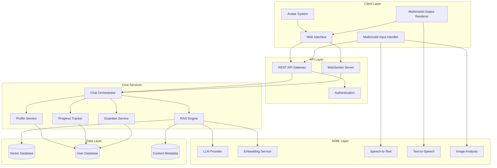

# Design Document: Autism Science Tutor

## Overview

This document describes the technical design for an AI-powered science tutor built specifically for autistic students aged 10-16. The system uses Retrieval-Augmented Generation (RAG) to deliver personalized, curriculum-aligned science education with extensive accessibility accommodations.

The architecture follows a modular design with clear separation between:
- Content ingestion and embedding pipeline
- RAG query and response generation
- User interaction and accessibility layer
- Profile management and analytics

## Architecture



## Components and Interfaces

### 1. Content Ingestion Pipeline

Handles uploading, processing, and embedding educational materials.

```
Interface ContentIngestionService:
    uploadDocument(file: File, metadata: ContentMetadata) -> DocumentId
    processDocument(documentId: DocumentId) -> ProcessingResult
    deleteDocument(documentId: DocumentId) -> Boolean
    listDocuments(filters: ContentFilters) -> Document[]

Interface ContentMetadata:
    grade: Integer (5-10)
    syllabus: Enum (CBSE, STATE)
    subject: String
    chapter: String
    contentType: Enum (TEXTBOOK, NOTES, PAST_PAPER, QUESTION_BANK)

Interface ProcessingResult:
    documentId: DocumentId
    chunkCount: Integer
    embeddingStatus: Enum (SUCCESS, PARTIAL, FAILED)
    errors: String[]
```

### 2. RAG Engine

Core retrieval and generation system.

```
Interface RAGEngine:
    query(question: String, context: QueryContext) -> RAGResponse
    retrieveChunks(question: String, filters: ContentFilters, topK: Integer) -> Chunk[]

Interface QueryContext:
    studentId: UserId
    grade: Integer
    syllabus: Enum
    conversationHistory: Message[]
    learningProfile: LearningProfile

Interface RAGResponse:
    answer: String
    sources: Source[]
    confidence: Float
    suggestedFollowUps: String[]

Interface Chunk:
    content: String
    metadata: ContentMetadata
    similarity: Float
```

### 3. Chat Orchestrator

Manages conversation flow, comprehension checks, and response formatting.

```
Interface ChatOrchestrator:
    processMessage(input: UserInput, sessionId: SessionId) -> ChatResponse
    getComprehensionOptions() -> ComprehensionOption[]
    handleComprehensionFeedback(feedback: ComprehensionFeedback) -> ChatResponse
    getOutputModeOptions() -> OutputModeOption[]
    changeOutputMode(mode: OutputMode) -> Void

Interface UserInput:
    type: Enum (TEXT, VOICE, IMAGE, BUTTON_CLICK)
    content: String | AudioBlob | ImageBlob
    source: Enum (STUDENT, GUARDIAN)

Interface ChatResponse:
    message: String
    audioUrl: String (optional)
    visualAid: VisualAid (optional)
    comprehensionButtons: ComprehensionOption[]
    outputModeOptions: OutputModeOption[]
    suggestedResponses: String[]
    breakdownParts: ExplanationPart[] (optional)

Interface ComprehensionOption:
    id: String
    label: String
    icon: String
    value: Enum (UNDERSTOOD, PARTIAL, NOT_UNDERSTOOD)

Interface ExplanationPart:
    id: String
    title: String
    summary: String
    canExpand: Boolean
```

### 4. Profile Service

Manages learning profiles and preference adaptation.

```
Interface ProfileService:
    getProfile(userId: UserId) -> LearningProfile
    updateProfile(userId: UserId, updates: ProfileUpdate) -> LearningProfile
    recordInteraction(userId: UserId, interaction: Interaction) -> Void
    getPreferredOutputMode(userId: UserId) -> OutputMode
    getPreferredExplanationStyle(userId: UserId) -> ExplanationStyle

Interface LearningProfile:
    userId: UserId
    preferredOutputMode: OutputMode
    preferredExplanationStyle: ExplanationStyle
    interactionSpeed: Enum (SLOW, MEDIUM, FAST)
    comprehensionPatterns: TopicComprehension[]
    interfacePreferences: InterfacePreferences
    createdAt: Timestamp
    updatedAt: Timestamp

Interface OutputMode:
    text: Boolean
    audio: Boolean
    visual: Boolean

Interface ExplanationStyle:
    useExamples: Boolean
    useDiagrams: Boolean
    useAnalogies: Boolean
    simplifyLanguage: Boolean
    stepByStep: Boolean

Interface InterfacePreferences:
    darkMode: Boolean
    fontSize: Enum (SMALL, MEDIUM, LARGE)
    reducedMotion: Boolean
    highContrast: Boolean
```

### 5. Progress Tracker

Tracks learning progress with child-friendly presentation.

```
Interface ProgressTracker:
    recordTopicCoverage(userId: UserId, topic: Topic, comprehension: Float) -> Void
    getProgress(userId: UserId) -> ProgressSummary
    getTopicsNeedingReview(userId: UserId) -> Topic[]
    getAchievements(userId: UserId) -> Achievement[]
    getDetailedReport(userId: UserId) -> DetailedReport (guardian only)

Interface ProgressSummary:
    topicsCovered: Integer
    totalTopics: Integer
    currentStreak: Integer
    recentAchievements: Achievement[]
    strengthAreas: Topic[]
    growthAreas: Topic[]

Interface Achievement:
    id: String
    title: String
    description: String
    icon: String
    earnedAt: Timestamp
```

### 6. Guardian Service

Manages guardian assistance and independence tracking.

```
Interface GuardianService:
    linkGuardian(studentId: UserId, guardianId: UserId) -> Void
    recordGuardianInput(sessionId: SessionId, input: String) -> Void
    getIndependenceMetrics(studentId: UserId) -> IndependenceMetrics
    getSessionHistory(studentId: UserId) -> Session[]
    sendAlert(studentId: UserId, alertType: AlertType) -> Void

Interface IndependenceMetrics:
    totalInteractions: Integer
    studentInteractions: Integer
    guardianInteractions: Integer
    independenceRatio: Float
    trend: Enum (IMPROVING, STABLE, DECLINING)
    weeklyBreakdown: WeeklyMetric[]
```

### 7. Calm Mode Service

Handles sensory regulation features.

```
Interface CalmModeService:
    activateBreak(userId: UserId) -> BreakSession
    startBreathingExercise(userId: UserId) -> BreathingSession
    playCalm Music(userId: UserId) -> AudioStream
    triggerEmergencyAlert(userId: UserId) -> Void
    endBreak(userId: UserId) -> Void

Interface BreakSession:
    sessionId: String
    startedAt: Timestamp
    breathingExerciseActive: Boolean
    musicPlaying: Boolean

Interface BreathingSession:
    pattern: Enum (BOX_BREATHING, 4_7_8, SIMPLE)
    currentPhase: Enum (INHALE, HOLD, EXHALE, REST)
    remainingCycles: Integer
```

### 8. Multimodal Input Handler

Processes different input types.

```
Interface MultimodalInputHandler:
    processTextInput(text: String) -> ProcessedInput
    processVoiceInput(audio: AudioBlob) -> ProcessedInput
    processImageInput(image: ImageBlob) -> ProcessedInput
    processButtonClick(buttonId: String) -> ProcessedInput

Interface ProcessedInput:
    normalizedText: String
    intent: Intent (optional)
    extractedEntities: Entity[]
    confidence: Float
```

### 9. Multimodal Output Renderer

Generates different output formats.

```
Interface MultimodalOutputRenderer:
    renderText(content: String, style: TextStyle) -> RenderedText
    renderAudio(content: String, voice: VoiceConfig) -> AudioBlob
    renderVisualAid(type: VisualType, data: VisualData) -> VisualAid
    renderComprehensionButtons(options: ComprehensionOption[]) -> ButtonGroup

Interface VisualAid:
    type: Enum (DIAGRAM, CHART, IMAGE, ANIMATION)
    url: String
    altText: String
    caption: String
```

## Data Models

### User Model

```
Model User:
    id: UUID (primary key)
    email: String (unique)
    role: Enum (STUDENT, GUARDIAN, ADMIN)
    name: String
    grade: Integer (5-10, for students)
    syllabus: Enum (CBSE, STATE, for students)
    linkedGuardianId: UUID (optional, for students)
    linkedStudentIds: UUID[] (for guardians)
    createdAt: Timestamp
    updatedAt: Timestamp
```

### Learning Profile Model

```
Model LearningProfile:
    id: UUID (primary key)
    userId: UUID (foreign key -> User)
    preferredOutputMode: JSON {text: Boolean, audio: Boolean, visual: Boolean}
    preferredExplanationStyle: JSON
    interactionSpeed: String
    interfacePreferences: JSON
    comprehensionHistory: JSON[]
    createdAt: Timestamp
    updatedAt: Timestamp
```

### Session Model

```
Model Session:
    id: UUID (primary key)
    userId: UUID (foreign key -> User)
    startedAt: Timestamp
    endedAt: Timestamp (optional)
    messages: Message[]
    topicsCovered: String[]
    comprehensionScores: JSON
    guardianInputCount: Integer
    studentInputCount: Integer
```

### Message Model

```
Model Message:
    id: UUID (primary key)
    sessionId: UUID (foreign key -> Session)
    role: Enum (STUDENT, GUARDIAN, AI)
    inputType: Enum (TEXT, VOICE, IMAGE, BUTTON)
    content: String
    audioUrl: String (optional)
    visualAidUrl: String (optional)
    comprehensionFeedback: String (optional)
    timestamp: Timestamp
```

### Document Model

```
Model Document:
    id: UUID (primary key)
    filename: String
    contentType: Enum (TEXTBOOK, NOTES, PAST_PAPER, QUESTION_BANK)
    grade: Integer
    syllabus: Enum (CBSE, STATE)
    subject: String
    chapter: String
    chunkCount: Integer
    uploadedAt: Timestamp
    processedAt: Timestamp (optional)
    status: Enum (PENDING, PROCESSING, READY, FAILED)
```

### Progress Model

```
Model Progress:
    id: UUID (primary key)
    userId: UUID (foreign key -> User)
    topicId: String
    topicName: String
    grade: Integer
    comprehensionLevel: Float (0-1)
    timesReviewed: Integer
    lastReviewedAt: Timestamp
    createdAt: Timestamp
    updatedAt: Timestamp
```

### Achievement Model

```
Model Achievement:
    id: UUID (primary key)
    userId: UUID (foreign key -> User)
    achievementType: String
    title: String
    description: String
    earnedAt: Timestamp
```


## Correctness Properties

*A property is a characteristic or behavior that should hold true across all valid executions of a system—essentially, a formal statement about what the system should do. Properties serve as the bridge between human-readable specifications and machine-verifiable correctness guarantees.*

### Property 1: Document Embedding Round-Trip

*For any* valid educational document uploaded to the system, the document SHALL be converted to embeddings and stored such that it can be retrieved by semantically similar queries.

**Validates: Requirements 1.1**

### Property 2: RAG Retrieval Relevance

*For any* question asked by a student where relevant content exists in the Content_Store, the retrieved chunks SHALL have a semantic similarity score above the configured threshold to the question.

**Validates: Requirements 1.2**

### Property 3: Curriculum Content Categorization

*For any* uploaded content with grade and syllabus metadata, the Content_Store SHALL correctly store and filter content by grade level (5-10) and syllabus type (CBSE, State).

**Validates: Requirements 1.3, 12.1**

### Property 4: Uncertainty Indication

*For any* query where the maximum retrieval similarity score is below the confidence threshold, the Tutor_AI response SHALL include an uncertainty indicator and SHALL NOT present unverified information as fact.

**Validates: Requirements 1.4**

### Property 5: Learning Profile Schema Completeness

*For any* Learning_Profile, it SHALL contain all required fields: preferredOutputMode, preferredExplanationStyle (including examples, diagrams, step-by-step flags), interactionSpeed, and comprehensionPatterns.

**Validates: Requirements 2.1, 2.4**

### Property 6: Profile Updates from Interactions

*For any* sequence of student interactions within a session, the Learning_Profile SHALL be updated to reflect observed patterns (output mode usage, comprehension feedback, interaction timing).

**Validates: Requirements 2.2**

### Property 7: Session Preference Application

*For any* user with an existing Learning_Profile, starting a new session SHALL initialize the session with the stored preferences from that profile.

**Validates: Requirements 2.3**

### Property 8: Multimodal Input Acceptance

*For any* valid input (text string, audio blob, or image blob), the MultimodalInputHandler SHALL process it and return a ProcessedInput with normalizedText.

**Validates: Requirements 3.1, 3.2, 3.3, 3.4**

### Property 9: Text Output Presence

*For any* ChatResponse generated by the system, it SHALL contain a non-empty message text field.

**Validates: Requirements 4.1**

### Property 10: Audio Generation

*For any* text content, the MultimodalOutputRenderer SHALL be able to generate an audio representation via TTS.

**Validates: Requirements 4.2**

### Property 11: Output Mode Options in Responses

*For any* explanation response from the Tutor_AI, the ChatResponse SHALL include outputModeOptions allowing the student to request different formats.

**Validates: Requirements 4.4**

### Property 12: Output Mode Switching

*For any* session where a student changes output mode, subsequent responses SHALL respect the new output mode preference.

**Validates: Requirements 4.5**

### Property 13: Button Options for Minimal Interaction

*For any* ChatResponse that expects user input, it SHALL include suggestedResponses as clickable button options.

**Validates: Requirements 5.1, 5.5**

### Property 14: Comprehension Buttons After Explanations

*For any* explanation response from the Tutor_AI, the ChatResponse SHALL include comprehensionButtons with at least three options (Understood, Partially Understood, Not Understood).

**Validates: Requirements 5.2, 7.1**

### Property 15: Breakdown on Non-Understanding

*For any* comprehension feedback indicating "Partially Understood" or "Not Understood", the subsequent ChatResponse SHALL include breakdownParts that segment the explanation into selectable components.

**Validates: Requirements 5.3, 7.2**

### Property 16: Part Selection Triggers Detail

*For any* ExplanationPart selected by a student, the Tutor_AI SHALL respond with an in-depth explanation focused specifically on that part.

**Validates: Requirements 5.4, 7.3**

### Property 17: Avatar State Consistency

*For any* interaction state (idle, listening, thinking, explaining), the Avatar component SHALL reflect the corresponding visual state.

**Validates: Requirements 6.3**

### Property 18: Complexity Adaptation

*For any* student with a history of comprehension feedback, the Tutor_AI SHALL adjust explanation complexity inversely proportional to the frequency of "Not Understood" feedback on similar topics.

**Validates: Requirements 7.4**

### Property 19: Interface Customization Application

*For any* interface preference change (font size, contrast, spacing, dark mode), the UI SHALL immediately reflect the new setting.

**Validates: Requirements 8.4**

### Property 20: Break Mode Session Pause

*For any* active session, activating break mode SHALL pause the session state and prevent new learning interactions until break ends.

**Validates: Requirements 9.2**

### Property 21: Emergency Alert Response

*For any* emergency button press, the System SHALL display calming content AND send an alert to the linked guardian if one exists.

**Validates: Requirements 9.6**

### Property 22: Guardian Input Separation

*For any* message logged in a session, the source field SHALL correctly identify whether it came from STUDENT or GUARDIAN.

**Validates: Requirements 10.2**

### Property 23: Independence Ratio Calculation

*For any* student with session history, the independence ratio SHALL equal studentInteractions / (studentInteractions + guardianInteractions) across all sessions.

**Validates: Requirements 10.3**

### Property 24: Guardian Context in Processing

*For any* input marked as from GUARDIAN, the ChatOrchestrator SHALL process it with guardian context and the response SHALL acknowledge the guardian source.

**Validates: Requirements 10.4**

### Property 25: Guardian Access Control

*For any* guardian user, they SHALL only be able to access session history and progress data for students linked to their account.

**Validates: Requirements 10.5, 11.5**

### Property 26: Progress Recording

*For any* completed topic interaction with comprehension feedback, the Progress model SHALL be updated with the topic and comprehension level.

**Validates: Requirements 11.1**

### Property 27: Review Topic Identification

*For any* student with progress history, topics with comprehension level below the review threshold SHALL appear in getTopicsNeedingReview results.

**Validates: Requirements 11.4**

### Property 28: Curriculum Prioritization

*For any* RAG query from a student with grade and syllabus set, retrieved chunks from matching curriculum SHALL be ranked higher than non-matching content.

**Validates: Requirements 12.2**

### Property 29: Question to Curriculum Mapping

*For any* question processed by the RAG engine, the response SHALL include source references mapping to specific chapters and topics when available.

**Validates: Requirements 12.3**

### Property 30: Content Upload Validation

*For any* document upload with valid metadata (grade 5-10, syllabus CBSE/State, contentType in allowed values), the ContentIngestionService SHALL accept and process the document.

**Validates: Requirements 12.4**

## Error Handling

### Input Validation Errors

| Error Condition | Response |
|----------------|----------|
| Empty text input | Return friendly prompt suggesting what to ask |
| Invalid audio format | Return error with supported formats list |
| Image too large | Return error with size limit and compression suggestion |
| Missing required metadata on upload | Return validation error listing missing fields |

### RAG Engine Errors

| Error Condition | Response |
|----------------|----------|
| No relevant content found | Return uncertainty message with suggestion to rephrase |
| LLM service unavailable | Return friendly "taking a break" message, retry with backoff |
| Embedding service failure | Queue for retry, return temporary unavailable message |
| Vector DB connection failure | Fallback to cached responses if available, alert admin |

### Session Errors

| Error Condition | Response |
|----------------|----------|
| Session expired | Prompt to start new session, preserve context if possible |
| Profile not found | Create default profile, continue with defaults |
| Guardian not linked | Disable guardian features, prompt to link |

### External Service Errors

| Error Condition | Response |
|----------------|----------|
| STT transcription failure | Prompt to retry or switch to text input |
| TTS generation failure | Provide text-only response with retry option |
| Image analysis failure | Prompt to retry or describe the image in text |

### Emergency Handling

| Error Condition | Response |
|----------------|----------|
| Emergency button pressed | Immediately show calming content, alert guardian |
| Guardian alert delivery failure | Log for retry, show local calming resources |
| Break mode activation failure | Force UI to calm state regardless of backend |

## Testing Strategy

### Dual Testing Approach

This system requires both unit tests and property-based tests for comprehensive coverage:

- **Unit tests**: Verify specific examples, edge cases, integration points, and error conditions
- **Property tests**: Verify universal properties hold across all valid inputs using randomized testing

### Property-Based Testing Configuration

- **Framework**: fast-check (JavaScript/TypeScript)
- **Minimum iterations**: 100 per property test
- **Tag format**: `Feature: autism-science-tutor, Property {number}: {property_text}`

### Test Categories

#### 1. Content Ingestion Tests
- Unit: Specific document types (PDF, DOCX, images)
- Unit: Edge cases (empty files, corrupted files, oversized files)
- Property: Document embedding round-trip (Property 1)
- Property: Curriculum categorization (Property 3)
- Property: Content upload validation (Property 30)

#### 2. RAG Engine Tests
- Unit: Known question-answer pairs from curriculum
- Unit: Edge cases (empty query, very long query, special characters)
- Property: Retrieval relevance (Property 2)
- Property: Uncertainty indication (Property 4)
- Property: Curriculum prioritization (Property 28)
- Property: Question mapping (Property 29)

#### 3. Profile Management Tests
- Unit: Profile creation with defaults
- Unit: Profile update scenarios
- Property: Schema completeness (Property 5)
- Property: Updates from interactions (Property 6)
- Property: Session preference application (Property 7)

#### 4. Multimodal I/O Tests
- Unit: Each input type individually
- Unit: Each output type individually
- Property: Input acceptance (Property 8)
- Property: Text output presence (Property 9)
- Property: Audio generation (Property 10)
- Property: Output mode switching (Property 12)

#### 5. Comprehension Flow Tests
- Unit: Each comprehension feedback path
- Unit: Breakdown generation for specific topics
- Property: Comprehension buttons (Property 14)
- Property: Breakdown on non-understanding (Property 15)
- Property: Part selection detail (Property 16)
- Property: Complexity adaptation (Property 18)

#### 6. Accessibility Tests
- Unit: Dark mode toggle
- Unit: Font size changes
- Unit: Break mode activation
- Property: Interface customization (Property 19)
- Property: Break mode pause (Property 20)
- Property: Emergency response (Property 21)

#### 7. Guardian Integration Tests
- Unit: Guardian linking flow
- Unit: Input source identification
- Property: Input separation (Property 22)
- Property: Independence ratio (Property 23)
- Property: Guardian context (Property 24)
- Property: Access control (Property 25)

#### 8. Progress Tracking Tests
- Unit: Achievement triggers
- Unit: Progress visualization data
- Property: Progress recording (Property 26)
- Property: Review identification (Property 27)

### Integration Testing

- End-to-end conversation flows
- Multi-session profile persistence
- Guardian-student interaction scenarios
- Break mode and emergency flows
- Content upload to query pipeline

### Accessibility Compliance

- WCAG 2.1 AA compliance verification
- Screen reader compatibility
- Keyboard navigation
- Color contrast validation
- Reduced motion support
